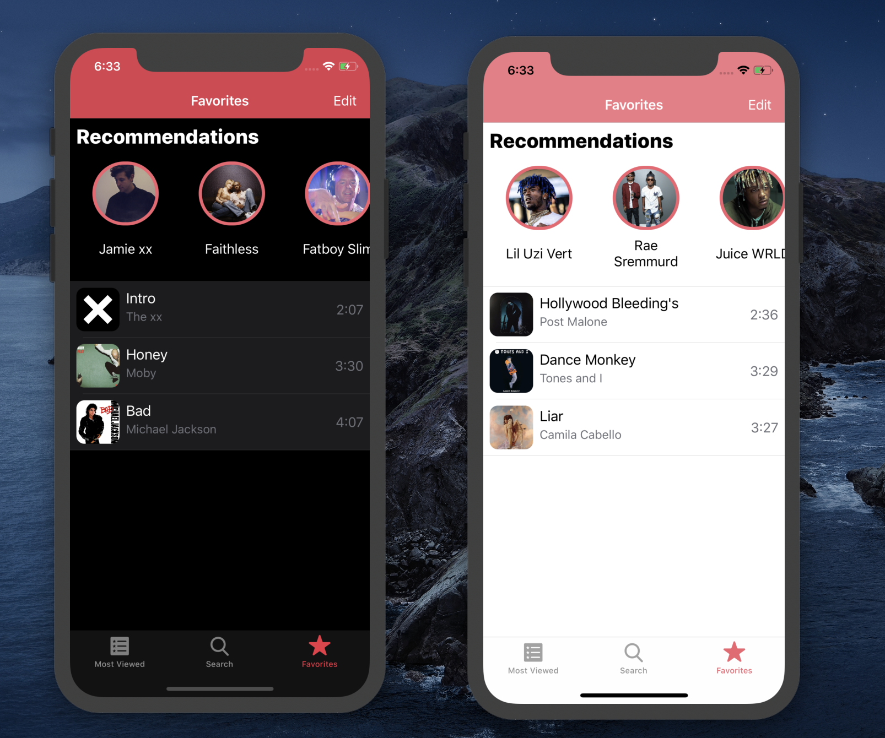

# Documentation - PG5600

I designed and built my app PopCave from scraps in order to salve the exam assignment. The app is fully built by me and all code is written by me. 

## Third party libraries
I have used third party libraries before when working with iOS code. They have been quite useful, especially coco pod libraries such as AlamoFire. However, libraries adds a complexity to the project and too many can make the app experience worse. I therefor decided to write all code self. This resulted in more code then what would be possible to produce by using third party libraries. My code might also be less optimized then specific libraries. So my greatest reasoning for not using third party libraries is the value of experimenting and testing for my self.

## Design
Design choices for me drove a lot of the coding in this project. The first thing I did when we got the assignment was to make a fake brand with a logo and color schema. It is written in the exam text that design is not emphasize, so all design I did was mostly for my self. However, I belive that a consistent and thought out design results in a overall better product. 

## Logo 
I went for a simple logo with only two colors in use. The name comes from the idea that this app is a horder of pop music through the ages and the arrow represents an eternal loop, just like a playlist set on repeat. 


## Screen sizes
As the assignment descried this code should work on all phone sizes in portrait mode. I decided to build for iOS 13 and newer, this means that some screen sizes are no longer included. Even so, I took this in to account and designed so it might have worked on the screen size of an iPhone 4 and older as well. The code now can run on iPhone 6s/iPhone SE and newer and should work quite well. 


## Dark Mode
The reason for me to build for iOS 13 and newer was to experiment with dark mode. This turned out to be quite easy. All views should now look good in both light and dark mode. 


## Core Data
I used core data quite a lot in this assignment. I decided to include all 50 most popular albums as well as their tracks (if user clicks in on one) in order to make second and future experiences of the app feel quick and fun. I also save albums the user clicks into in search and tracks in order to add the to favorites. 

There is no favorite track entity in the database and this is by design. The track entity has a attribute bool. This makes look up and changing stat on a track quite effective and fast. 

The last thing to be added to core data is the recommendations. This table is reset and filled every time the user adds or removes a favorite track. 

## Loading data from the web
All my functions that loads data form the internett uses quite the same structure, however there are several differences when the data is loaded. One of the smartest parts of swift has been the use of `Decodable` data structs. I use these for every data request. All the structs that implements decodable can be found under model and in the file DecodableStructs.swift. These structs could have gotten an own file, however, they are quite simple in there structure so I decided that it was more responsible to just add the in to a single file. 

A site I have used a lot in order to handle JSON data was [https://jsonformatter.curiousconcept.com][1]. This page helps you formate the JSON data in order to understanding it’s structure and how to access the data needed. This site made it clear to me how the `Decodable` structs should look and what they should include. 

## Extension
I split as much as possible in the view controller files into there own extension files just to make the code easier to read trough. Other then that I only extended Int and and TimeInterval. There extensions can be found under the model folder in the file Extensions.swift. 

```swift
extension TimeInterval {
    var minutesAndSecoundsString: String {
        return String(format:"%d:%02d", minute, second)
    }
    var minute: Int {
        return Int((self/60).truncatingRemainder(dividingBy: 60))
    }
    var second: Int {
        return Int(truncatingRemainder(dividingBy: 60))
    }
}

extension Int {
    var milisToSecounds: Double {
        return Double(self) / 1000
    }
}
```

This is the extensions in its entirety. They are only used in order to convert the Int string in milliseconds from theaudiodb.com into a string on the form mm:ss. 
This is more like the way that we are used to see time displayed in a music app. First I use the `milisToSecounds`variable to convert the int value into a Double and make it into second (no need to the milisecounds). Then I use the `minutesAndSecoundsString` in order to extract both the minutes and the seconds and return the data in the form I want it to be. I then use the `minute` and `secound` variables in order to truncate and extract only the relevant information. 

## Differences compared to the assignments
### Assignment 1
The first assignment was quite strait forward. I decided to make the collection view with big album artwork as default. All data in this first page is actually loaded into core data. This was because I started working on this assignment in a place without great internett. This allows the experience of the app to feel fast and smooth on all later times when you open the app. 

### Assignment 2
Making the cover art take up as much as possible of the screen turned out to be this screens biggest problem. It was quite easy on one screen size, however it should look as good as possible on all screen sizes. In order to make this happen it needed a lot of screen real estate. In order to keep this screen usable I decided to add all album information into a tableview header. This made it possible to scroll on the  full page which resulted in a more useful view.

On the track is as the assignment describe then name as well as play time. I also added a star to indicate if a track is currently a favorite or not. 


### Assignment 3
I used a collection view in order to display the albums on this page. In the top list view controller (TopListVC) I handle the changes to the UI by loading to different Xib files related to the same collection view cell. By clicking one on the segment controller you change the loaded Xib as well as how much space the cell should take up.

By clicking on a album the user will be taken into one of the the corresponding album view with a list of all tracks and a filled star if the track is loved. 


### Assignment 4
My search works a little different from the assignment. I registered as a developer on ​theaudiodb.com in order to get access to search for all albums related to an artist. This resulted in the opportunity to search for artists. This is also what my search now do first. If that does not result in anything, it will then search for albums with that name. Under is an example of search, left phone peached for an artist while right phone searched for one of the albums to the same artist. All data in search comes from the API. You can tap on any of the albums and access all the albums tracks. Here you can add any track into your favorite, just like you can do on the top 50 page. 


### Assignment 5
As described in previous parts there are several places where you can add favorites, but them all show up on this page. On top of the page is view containing a horizontal collection view where you can find recommendations based on the API described in the assignment. 

By tapping edit in top right you will   activate the opportunity to rearrange the tracks as well as deleting them. You can also delete a track from favorites by swiping on the cell. Both ways of deleting will activate a alert view in order for user to verify if they want to delete or not. 



I went a little further in this part of the assignment. If you tapp on any of the recommendations you will be taken to an artist view. This page showes you an selected artist and all albums by that artist (accessible from theaudiodb.com). This is done by two different calls to the site. The first one finds the artist and the second finds all related albums. If you tap on an album you will be taken to that albums detail view. Here you can add tracks into your favorites and by doing so, getting better predictions next time now based on recommendations you have gotten already. 


## Conclusion
Making an iPhone app is really fun. I have built many small apps before, with single use cases. This was my first big iPhone app project and dear I say, it turned out quite nicely. The app I ended up building is close to production ready in my eyes, however I’m not sure it you get a big user group. 

[1]:	https://jsonformatter.curiousconcept.com

